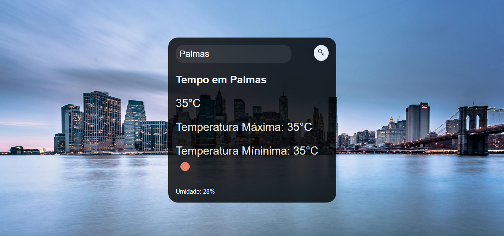

<h1> DevClub - Previsão do Tempo 🌤️</h1>
Este projeto é uma aplicação simples de previsão do tempo, desenvolvida com HTML, CSS e JavaScript, que utiliza a API do OpenWeatherMap para fornecer informações climáticas em tempo real com base na cidade digitada pelo usuário.

<h2>Funcionalidades 🛠️</h2>
Busca de cidade: O usuário pode digitar o nome da cidade e clicar no botão de busca (ou pressionar a tecla Enter) para ver a previsão do tempo.
Previsão em tempo real: Exibe a temperatura atual, temperatura máxima e mínima, umidade e o ícone correspondente ao clima da cidade.
Design responsivo: A interface foi construída para ser acessível em diferentes tamanhos de tela, com estilizações que adaptam o layout.
Tecnologias Utilizadas 💻
<h3> HTML5: </h3> Estrutura da página e integração com a API.
<h3> CSS3: </h3> Estilização da página, com foco em responsividade e uma interface amigável.
<h3> JavaScript: </h3> Lógica de busca e manipulação de dados da API OpenWeatherMap.
<h3> API OpenWeatherMap: </h3> Utilizada para acessar as informações climáticas.
Estrutura do Código 📝
HTML
<h2> A estrutura HTML do projeto inclui: </h2>

Um campo de input para a busca da cidade.
Um botão com um ícone de lupa que dispara a busca de dados da cidade digitada.
Uma área onde são exibidas as informações do clima, incluindo nome da cidade, temperatura, temperatura máxima e mínima, umidade e ícone de previsão.

<h2> CSS </h2>
O CSS foi utilizado para criar um design limpo e moderno:

<h3> Background: </h3> Imagem de fundo representando uma cidade, cobrindo toda a tela.
Container: A caixa central onde as informações são exibidas tem bordas arredondadas, transparência e adaptação responsiva.
Botão: O botão tem um design circular e muda de cor ao passar o mouse (hover).
css

<h2> JavaScript </h2>
O JavaScript é responsável por:

Buscar os dados climáticos da cidade digitada pelo usuário, através da função buscarCidade(), que utiliza a API do OpenWeatherMap.
Exibir as informações na tela como nome da cidade, temperatura atual, máxima e mínima, e a umidade, através da função colocarNaTela().
Eventos: O botão de busca e a tecla Enter são configurados para acionar a função de busca.

Minhas redes sociais:

